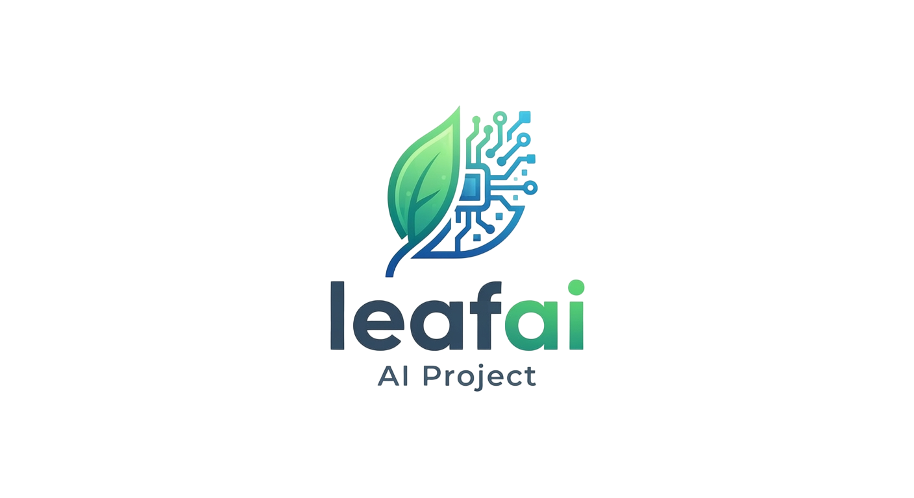

<p align="center">
  
</p>

# 🌿 Leafai - Leafai -- Sağlıklı Toprak Sağlıklı Yaşam

  


  

Leafai, PlantVillage veri seti üzerinde **MobileNetV2** mimarisi ve iki aşamalı **Fine-Tuning (İnce Ayar)** teknikleri kullanılarak eğitilmiş, yüksek başarı oranına sahip web tabanlı bir tarımsal yapay zeka teşhis sistemidir.

  

Proje, yalnızca statik tahmin yapmakla kalmaz; kullanıcı geri bildirimleriyle sürekli gelişen **Active Learning (Aktif Öğrenme / Human-in-the-Loop)** altyapısına sahiptir.

  

---

  

## 🎯 Proje Özellikleri

  

- **%99.28 Doğrulama Başarısı (Validation Accuracy):** 162.916 görsel içeren (Color, Grayscale, Segmented) devasa veri kümesi üzerinde eğitilmiştir.

- **Toplu ve Çoklu Analiz (Batch Prediction):** Birden fazla yaprak fotoğrafını aynı anda yükleyip saniyeler içinde toplu teşhis raporu alma.

- **Canlı HTML5 Kamera Desteği:** Masaüstü ve mobil cihazların kameralarıyla anlık fotoğraf çekip analiz etme.

- **Hiyerarşik Teşhis & Bitki Filtreleme:** Bitki Türü (Domates, Elma, Patates vb.) ve Hastalık Teşhisini ayrıştırarak gösterme; isteğe bağlı bitki filtresi uygulama.

- **Akıllı Güven Eşiği (Thresholding):** %65 altındaki düşük güvenli tahminlerde kullanıcıyı uyarma.

- **Kullanıcı Geri Bildirimi & Aktif Öğrenme (Human-in-the-Loop):** Yanlış tahminleri kullanıcıların düzeltmesine imkan tanıma ve düzeltilen verileri `data_pool/` klasöründe toplama.

- **Tek Tıkla Otomatik Yeniden Eğitim (`retrain.py`):** Veri havuzunda biriken gerçek dünya fotoğraflarıyla modeli anında güncelleyebilme.

  

---


## 📐 Sistem Mimarisi

```c

[Kullanıcı Arayüzü (Web / Kamera)]

│

▼ (HTTP POST / Multipart)

[FastAPI REST Servisi]

           │

┌──────────┴──────────┐

▼                     ▼

[Inference Engine] [Data Pool / Active Learning]

(PyTorch MobileNetV2) (Hatalı/Onaylı Veri Kaydı)

│                      │
 
▼                     ▼

[%99.28 Tahmin] [retrain.py (Auto Fine-Tune)]
```


📊 Model Eğitim Başarısı (Training Metrics)

```python
Model, NVIDIA RTX 3060 GPU üzerinde 2 aşamalı olarak eğitilmiştir:

Isınma Aşaması (Warmup - 3 Epoch): Gövde kilitli, sadece sınıflandırıcı eğitildi (lr=1e-3).

Fine-Tuning Aşaması (7 Epoch): MobileNetV2 derin katmanlarının kilidi açıldı (lr=1e-4).
```

```python
Epoch 01/10 (Warmup) | Val Acc: %92.55 | Loss: 0.2274

Epoch 04/10 (FineTune) | Val Acc: %97.75 | Loss: 0.0637

Epoch 07/10 (FineTune) | Val Acc: %99.18 | Loss: 0.0238

Epoch 10/10 (FineTune) | Val Acc: %99.28 | Loss: 0.0213 ⭐ (EN İYİ MODEL)
```


🚀 Kurulum ve Çalıştırma
```python
Proje, işletim sisteminize uygun otomatik başlatma ve eğitim betikleri barındırır. Sanal ortam (`.venv`) ve kütüphaneler otomatik olarak yapılandırılır.

### 🐧 Linux / macOS Kullanıcıları İçin

1. **İzinleri Verin (İlk Çalıştırmada Tek Seferlik):**
   ```bash
   chmod +x start.sh train.sh
```

1. **Web Uygulamasını Başlatmak İçin:**

    ```python
    ./start.sh
    ```

2. **Modeli Eğitmek İçin:**

    ```python
    ./train.sh
    ```

---

### 🪟 Windows Kullanıcıları İçin

- **Web Uygulamasını Başlatmak İçin:** start.bat dosyasına çift tıklayın. (Tarayıcınız http://127.0.0.1:8000 adresiyle otomatik açılacaktır).
    
- **Modeli Sıfırdan Eğitmek İçin:** train.bat dosyasına çift tıklayın.
    

---

### 💻 Manuel Kurulum (Alternatif Terminal Kullanımı)

```python
python -m venv .venv
source .venv/bin/activate  # Windows: .venv\Scripts\activate
pip install -r requirements.txt

# Web Sunucusunu Başlatma
uvicorn main:app --reload
```

🛠️ Kullanılan Teknolojiler

| Backend / API    | FastAPI, Uvicorn, Pydantic                        |
| ---------------- | ------------------------------------------------- |
| Deep Learning    | PyTorch, Torchvision, MobileNetV2                 |
| Image Processing | Pillow                                            |
| Frontend         | HTML5, CSS3, JavaScript (Fetch API, MediaDevices) |
| Data Source      | Kaggle PlantVillage Dataset (162k Images)<br>     |
---

## 📜 Lisans ve Atıf (License & Citation)

Bu proje **[CC BY-NC-SA 4.0 (Creative Commons Attribution-NonCommercial-ShareAlike 4.0 International)](https://creativecommons.org/licenses/by-nc-sa/4.0/)** lisansı altında yayınlanmıştır. 

### 📚 Veri Seti Atıfı (Dataset Attribution)
Bu projedeki modelin eğitiminde kullanılan PlantVillage veri seti aşağıdaki akademik çalışmaya aittir:

- **Veri Seti:** PlantVillage Dataset.
- **Yazarlar:** David P. Hughes, Marcel Salathé (2015)
- **Orijinal Yayın:** *Hughes, D., & Salathé, M. (2015). An open access repository of plant leaf images and diagnoses for plant disease detection. arXiv preprint arXiv:1511.08065.*
- **Veri Seti Lisansı:** [CC BY-NC-SA 4.0](https://creativecommons.org/licenses/by-nc-sa/4.0/)

## 👥 Geliştirici Ekibi (Team & Contributors)

- **[Ahmet Buğra Girgin / BFM-lab](https://github.com/BFM-lab)** - Kurucu & Baş AI Mühendisi
- **[Muhammed Emin Duyar / Joker-qp](https://github.com/Joker-qp)** - Yazılım Geliştirici (Co-Lead Developer)
